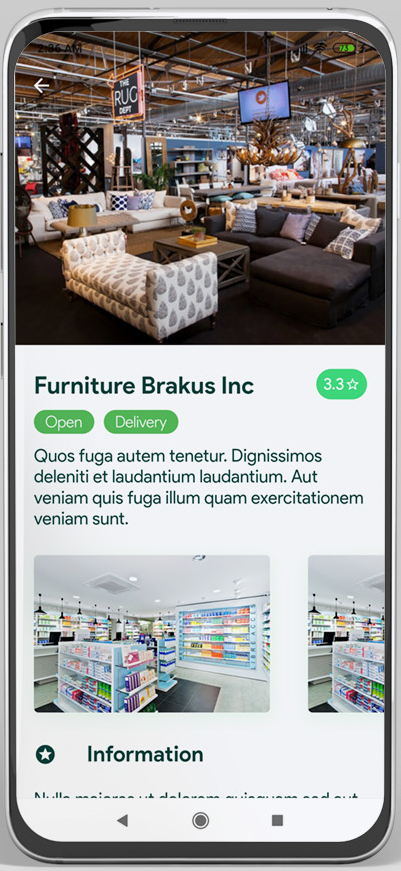
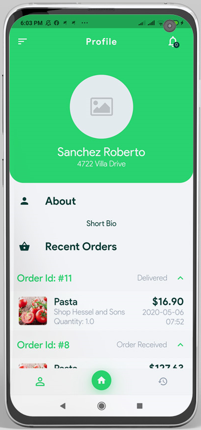
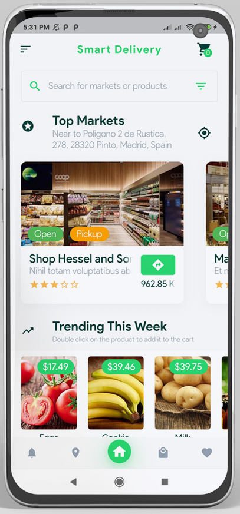
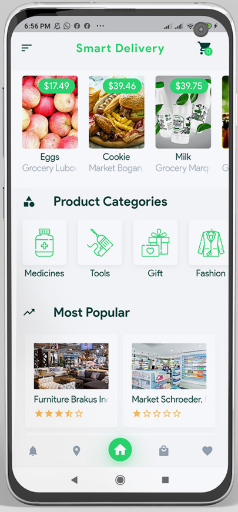
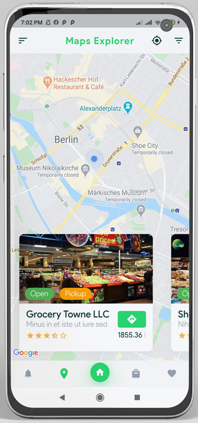
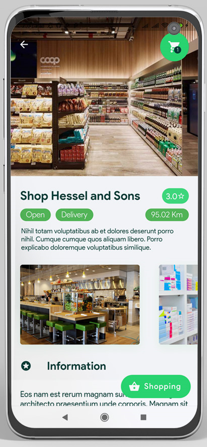

# FoodDelivery-Vendor-Flutter

### Flutter App Features:
Grocery, Food, Pharmacy, Store Management System
Google Maps for showing restaurants on the maps with direction to them
Entities & Models are ready to use.
Clean & organized Dart Language code using MVC Pattern
Easy to restyle and theming by on your branding sites.
Working fine with bright and dark mode.
Awesome animations are ready to use: Hero Animations, Parallax Animations, Sliding & Swiping animations
Working really well on both iOS and Android with support with 60 frames per second (fps).
Cash on delivery and payment on pickup methods
Support RTL languages (Arabic, Farisi…)
Push notification using FCM (Firebase Cloud Messaging)
Login
Register
Orders
Notifications
User Profile
Orders History
App Settings
App Languages
Help & Supports
Account Settings

### Get Started

1- Download and unzip the Flutter App, use your preferred IDE (Android Studio / Visual Code / IntelliJ) to open the project.

2 - Open /assets/cfg/configurations.json and edit the remote link to connect your mobile app with your admin panel
{
  "api_base_url": "http://yourdomain.com/public/api/",
  "base_url": "http://yourdomain.com/public/"
}

3- Go to /assets/img/logo.png and replace it with your logo or app icon.

4 - Create your own Google Maps API key at https://cloud.google.com/maps-platform/.

5 - Google Maps API Checker

### Android Configuration

### Create your app icon
After you generate icons folder replace the following folders:

/mipmap-hdpi in /android/app/src/main/res/ folder
/mipmap-mdpi in /android/app/src/main/res/ folder
/mipmap-xhdpi in /android/app/src/main/res/ folder
/mipmap-xxhdpi in /android/app/src/main/res/ folder
/mipmap-xxxhdpi in /android/app/src/main/res/ folder

### Change Package Name
If you want to change the package name following the next steps

1 - Open /android/app/build.gradle and change the package name
    defaultConfig {
        applicationId "<REPLACE WITH YOUR PACKAGE NAME>" // this is the package name
        minSdkVersion 19
        targetSdkVersion 29
        versionCode flutterVersionCode.toInteger()
        versionName flutterVersionName
        testInstrumentationRunner "android.support.test.runner.AndroidJUnitRunner"
    }
  
2- Open /android/app/src/main/AndroidManifest.xml , /android/app/src/profil/AndroidManifest.xml, /android/app/src/debug/AndroidManifest.xml and specify your:

YOUR PACKAGE NAME
YOUR APPLICATION NAME
YOUR GOOGLE MAPS KEY

### OS Configuration

Google Maps Key
Specify your API key in the application delegate ios/Runner/AppDelegate.m:

#include "AppDelegate.h"
#include "GeneratedPluginRegistrant.h"
#import "GoogleMaps/GoogleMaps.h"

@implementation AppDelegate

- (BOOL)application:(UIApplication *)application
    didFinishLaunchingWithOptions:(NSDictionary *)launchOptions {
  [GMSServices provideAPIKey:@"YOUR KEY HERE"];
  [GeneratedPluginRegistrant registerWithRegistry:self];
  return [super application:application didFinishLaunchingWithOptions:launchOptions];
}
@end

Or in your swift code, specify your API key in the application delegate ios/Runner/AppDelegate.swift:

import UIKit
import Flutter
import GoogleMaps

@UIApplicationMain
@objc class AppDelegate: FlutterAppDelegate {
  override func application(
    _ application: UIApplication,
    didFinishLaunchingWithOptions launchOptions: [UIApplicationLaunchOptionsKey: Any]?
  ) -> Bool {
    GMSServices.provideAPIKey("YOUR KEY HERE")
    GeneratedPluginRegistrant.register(with: self)
    return super.application(application, didFinishLaunchingWithOptions: launchOptions)
  }
}

### Push Notifications
To integrate your plugin into the iOS part of your app, follow these steps:

Generate the certificates required by Apple for receiving push notifications following this guide in the Firebase docs. You can skip the section titled "Create the Provisioning Profile".

Using the Firebase Console add an iOS app to your project: Follow the assistant, download the generated GoogleService-Info.plist file, open ios/Runner.xcworkspace with Xcode, and within Xcode place the file inside ios/Runner. Don't follow the steps named "Add Firebase SDK" and "Add initialization code" in the Firebase assistant.

In Xcode, select Runner in the Project Navigator. In the Capabilities Tab turn on Push Notifications and Background Modes, and enable Background fetch and Remote notifications under Background Modes.

Follow the steps in the "Upload your APNs certificate" section of the Firebase docs.

If you need to disable the method swizzling done by the FCM iOS SDK (e.g. so that you can use this plugin with other notification plugins) then add the following to your application's Info.plist file.

<key>FirebaseAppDelegateProxyEnabled</key>
<false/>

Objective-C:
if (@available(iOS 10.0, *)) {
  [UNUserNotificationCenter currentNotificationCenter].delegate = (id<UNUserNotificationCenterDelegate>) self;
}
Swift:
if #available(iOS 10.0, *) {
  UNUserNotificationCenter.current().delegate = self as? UNUserNotificationCenterDelegate
}

## Screenshot

|                Screenshot               | Screenshot |
|:---------------------------------------:|:-------------------------------------:|
|    |      |

|                Screenshot               | Screenshot |
|:---------------------------------------:|:-------------------------------------:|
|    |      |

|                Screenshot               | Screenshot |
|:---------------------------------------:|:-------------------------------------:|
|    |      |
